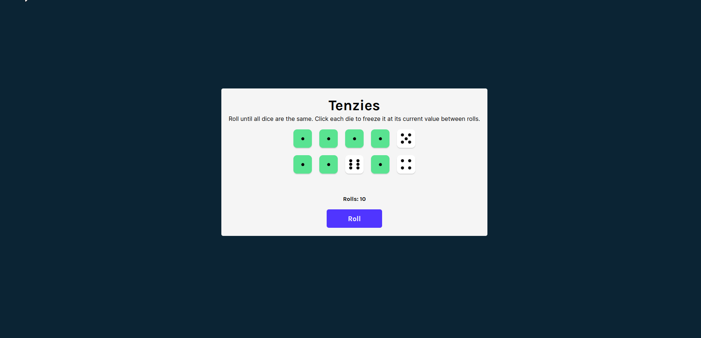

# Tenzies
Tenzies is a simple dice game commonly played by children. This was a quick React app spun up with Vite.

**Link to project:** *Coming soon... like within minutes!*
## How It's Made:

**Tech used:** HTML, CSS, JavaScript, React + Vite
.
Created with HTML by way of JSX and React and styled with CSS.
It makes use of the `react-confetti` package to help make it clear when a player has won (and it's just a fun little package to use 🙂)
and `nanoid` to quickly create unique IDs for the die components. 

## Lessons Learned:
Though this is my take on Bob Ziroll's Tenzies app, which he created to demonstrate and teach React, I thought it would be a fun way to incorporate React in a little refresher on CSS grid that I needed before incorporating a larger grid layout on a client's site. I definitely learned a few best practices with React that I didn't know beforehand, one being to not tie component keys to array indices. (Hence why I had to use `nanoid`).

